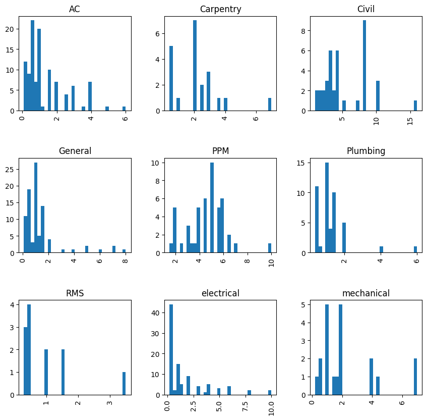

# Millennium Kurdistan Hotel and Spa Maintenance Time  Estimator: Project Overview:

- created a tool to estimate how much time any upcoming complaint would take (MAE 0.84 hours)
- prepared, and cleaned data 
- created linear, lasso, ridge regression as well as random forests 
- optimzed each model using GridsearchCV 
- build a flask API to do predictions 
---

# Code and Recourses:
1. **Python Version** = Python 3.11.1
2. **Packages** = Pandas,numpy, matplotlib, seaborn, sklearn, json, flask, pickle

3. **For web framework requirements run**  
```sh
pip install -r requirements1.txt
``` 

4. **youtube videos used** https://www.youtube.com/watch?v=MpF9HENQjDo&list=PL2zq7klxX5ASFejJj80ob9ZAnBHdz5O1t
---
# Data Preparation(cleaning)
- combined words that were spelled differently but were the same 
- removed white spaces
- changed compatible columns to 0 and 1 formats 
- changed dtypes to appropriate ones 
- created a CSV to the end product 
---
# EDA
Feature understanding and feature relationships were explored both numerically and visually, and critical questions were asked about the data.


  

---
# Model Buidling
First, relative columns were chosen. Then. dummy columns were created to facilitate model building. lastly, train-test split was created.

Four models were built, and were evalauted using MAE.

---
# Model Performance

Lasso regression gave the best predictions. Linear regression is not mentioned below because it produced non relaistic results due to collinearity and/or outliers, but since we were only interested in prediction performance, we did not fix this issue, and models were picked that are not affected by collinearity. 

**MAE after optimization**
lasso 0.843 hours
ridge  0.94 hours 
random forest 0.920 hours

---
# productionizing our model 

Created a flask API endpoiant that is predicted locaaly which predicts maintenance time when a list of values is given to it. This API was created following the tutorial mentioned in the resources section.


   


